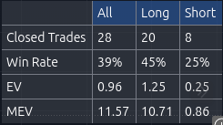

# StrategyBlueprint

Produced for TRW by Mark The Systemizer, with contributions by GreatestUsername and Prof Michael. All current TRW members are free to use this code. IYKYK

## Position Sizing
Issue with 1%
A 1% position sizing skews results based on older results. If a strategy is highly profitable early on, it’s end result will be disproportionately higher based on compounding effect. Additionally, with the price of BTC being so high, a super tight stop will mean that the qty is too large for the capital available.

Solution to this is to keep all entries to be done at $1 of risk. This removes the compounding effect and produces a more realistic equity curve.

`qty = 1 / abs(close - stop)`

## EV
### EV vs Profit Factor
TradingView uses profit factor, which is calculated as

`profit_factor = strategy.grossprofit / strategy.grossloss`

This is very different from EV

`EV = (Win Probability × Average Win) - (Loss Probability × Average Loss)`

I’ve seen a big profit factor that returns very little EV. With this in mind I now track EV for a strategy and use that as the main analysis tool.

## Refining Entries based on EV

Included in this codebase is a TradingView Assistant (based on the original code https://github.com/akumidv/tradingview-assistant-chrome-extension) but I've stripped it back and added EV. This has been the best way I have found of fine tuning the indicator settings. To add it 
1. Download this repo
2. Visit [chrome://extensions/](chrome://extensions/) 
3. Turn on developer mode
4. `Load unpacked`
5. Select this folder you've downloaded 
6. Go to TradingView, 
7. Add a shorttitle of `test` to your strategy
8. Click the extension  and follow it from there. 

## EV Heatmap
There is a significant difference in how a strategy performs based on day and time of the week. I’ve found strategies that trade 24/7 experience frequent losses. Solution is to analyse an EV Heatmap and remove poor performing times

For the above, I would remove Thursday and Saturday.

This instantly improves EV. Next is to only trade during key times. 03:00 -> 05:45, 07:00 -> 10:45 and 16:00 -> 23:45

By analysing the heatmap, EV has jumped from 0.16 - 0.46

## Comparing 2 strategies

When compairing strategies over different timeframes, it's important to remember that a strategy with low EV that trades a lot, will beat a higher EV which rarely triggers. To compare the 2, the best thing to do is use the MEV (Monthly Expected Value)

`MEV = EV * Number of trades / Months traded for`

## Full process
1. Build entry rules
2. Check long entries are firing correctly.
3. Check short entries are firing correctly.
4. Amend exit rules to improve EV
    1. RR
    2. Trailing stop size
5. Use Chrome extension to fine tune entries
6. Select long only
7. Analyse the CSV and use the best EV for long entries
8. Review heatmap and remove unprofitable days
9. Review heatmap and only trade during profitable times
10. If not profitable abandon, otherwise paper trade
11. Repeat steps 6-10
12. Scale up, 10 trades at each level minimum. Only progress if it’s still profitable
    1. Forward test
    2. $1
    3. $2
    4. $4
    5. $8
    6. $10
    7. $15
    8. $20
    9. $30
    10. $50
    11. 1%
12. Repeat steps 5-12 for different coins and timeframes
13. Buy Lambo

## Strategy template

See [Strategy.pine](strategy.pine) for the strategy template

## Utils template

See [Utils.pine](utils.pine) for the utils template